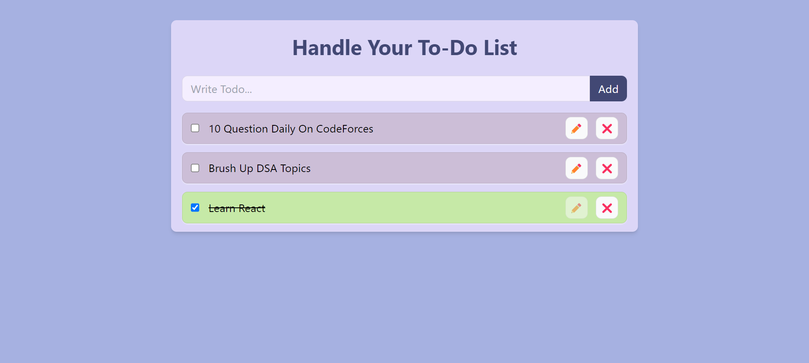

# To-Do List Web Application



## Description

This is a web-based to-do list application built with React, designed to help you stay organized and manage your tasks efficiently. It offers a user-friendly interface for adding, updating, and marking tasks as completed, making it easier to keep track of your daily responsibilities.

## Features

- Add Tasks: Easily add new tasks to your to-do list.
- Update Tasks: Edit and modify existing tasks to keep your list up-to-date.
- Mark as Completed: Toggle the completion status of tasks with a single click.
- Data Persistence: Your to-do list is stored in your browser's localStorage, ensuring your tasks are saved between sessions.
- Responsive Design: The application is designed to work seamlessly on different screen sizes.


## Technologies Used

- React
- JavaScript
- Tailwind CSS

## How to Use:
- Clone the repository to your local machine.
- Run npm install to install the necessary dependencies.
- Start the development server with npm start.
- Open the application in your web browser to start managing your to-do list.
- Stay organized and manage your tasks with ease using this simple and intuitive to-do list application.


## Installation

1. Clone the repository:

   ```bash
   git clone https://github.com/kratin01/To-do-List.git
